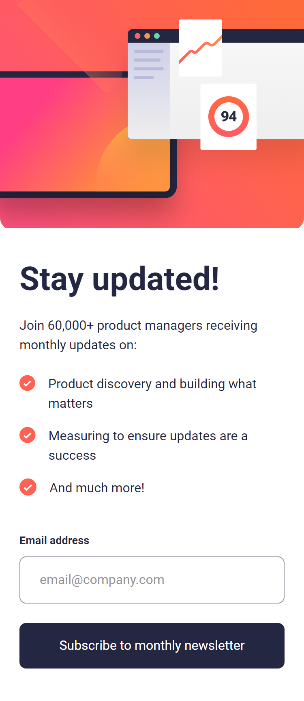
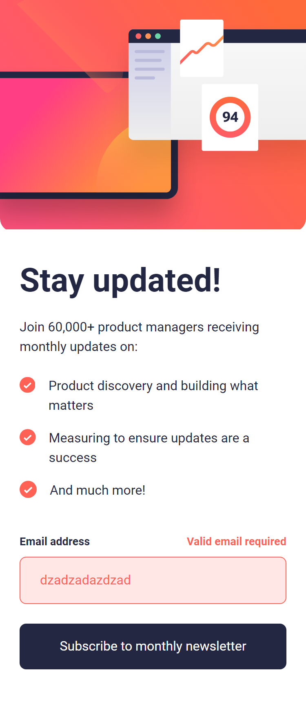
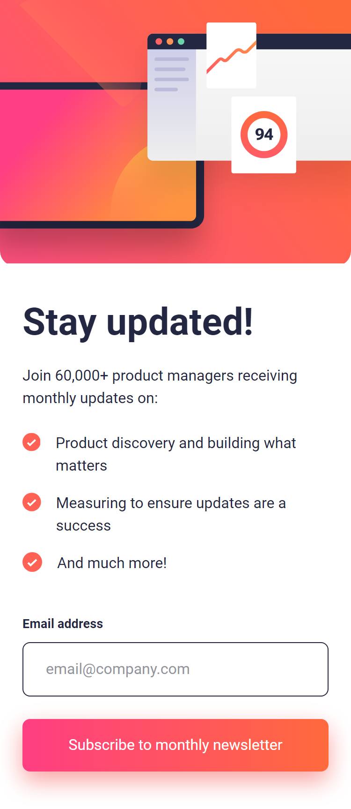
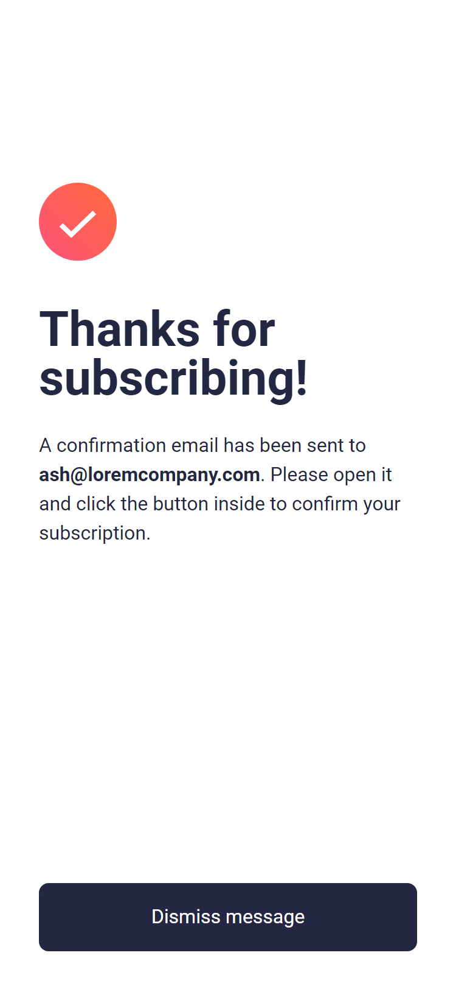
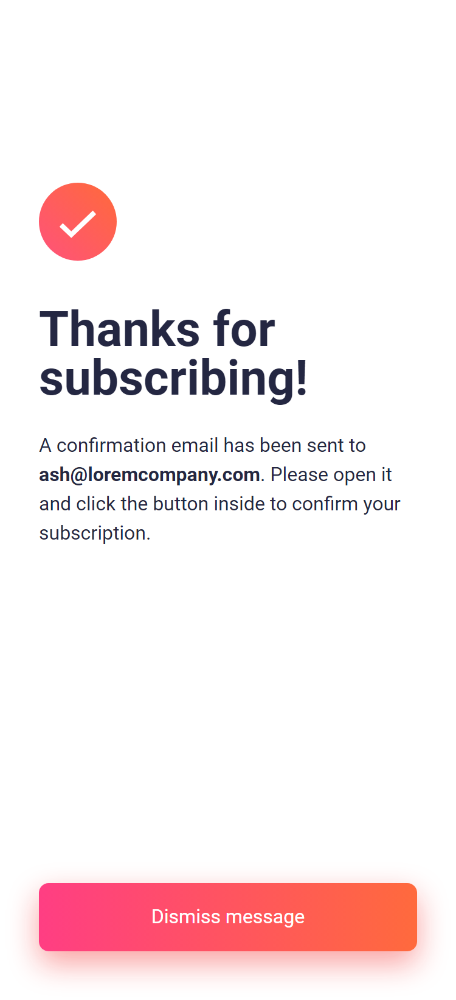
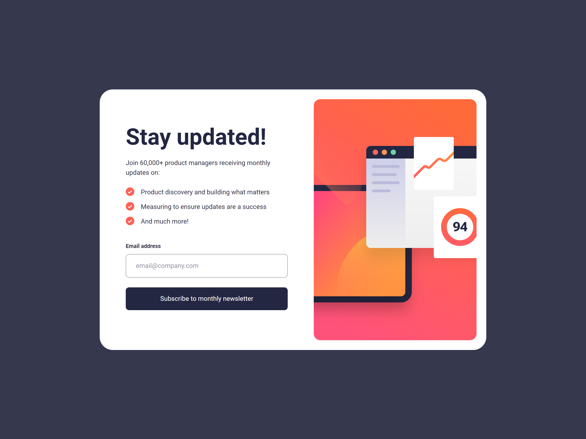
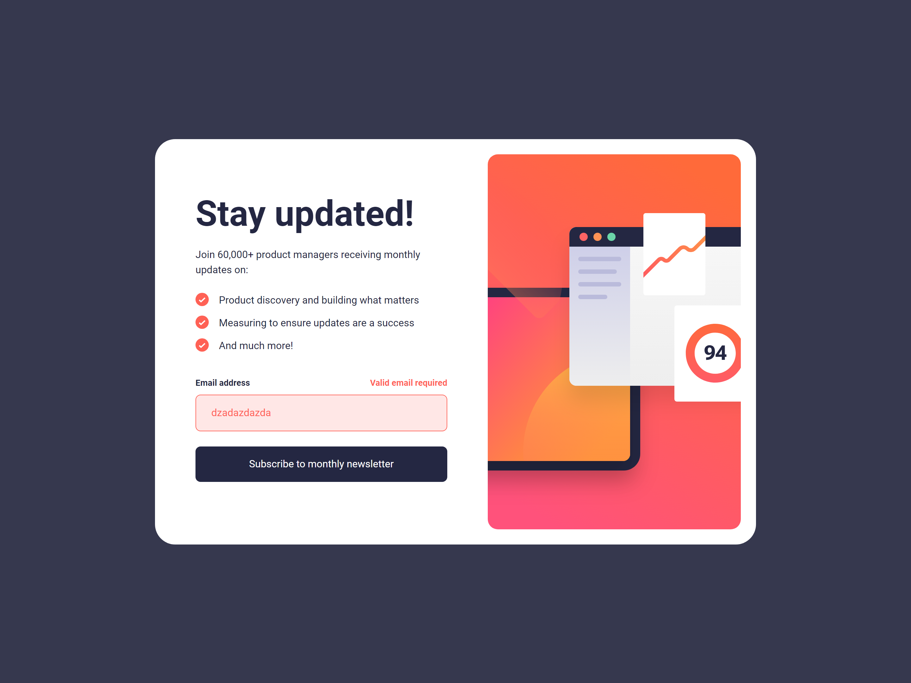
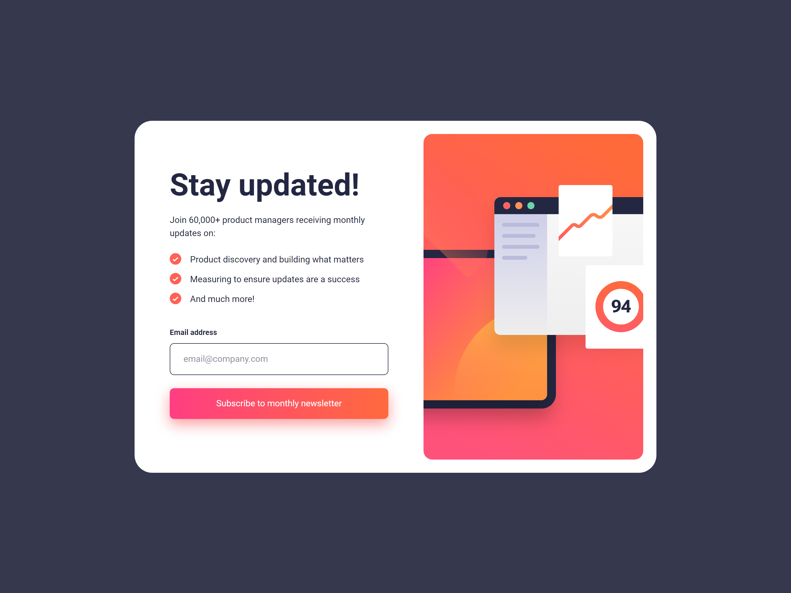
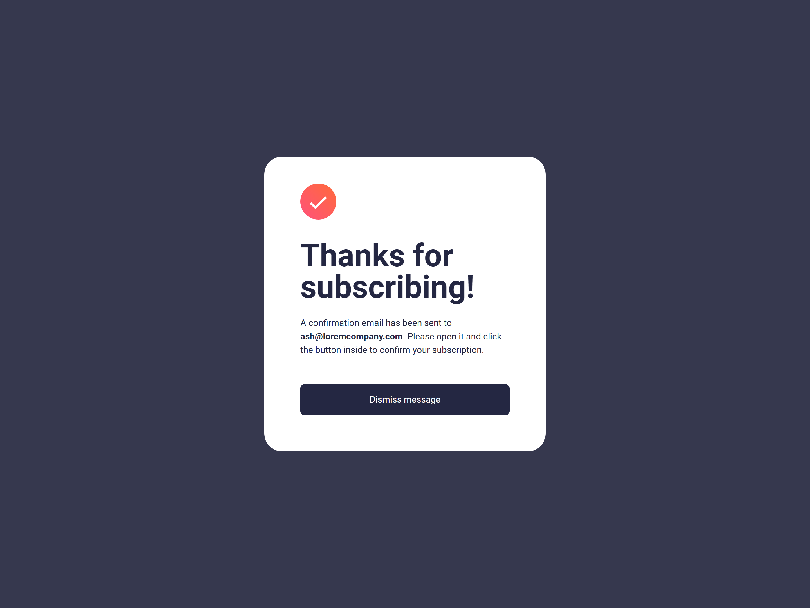
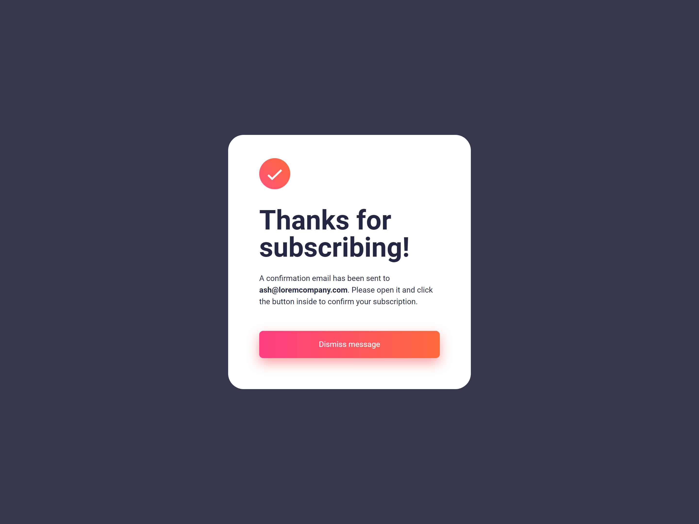

# Frontend Mentor - Newsletter sign-up form with success message solution

This is a solution to the [Newsletter sign-up form with success message challenge on Frontend Mentor](https://www.frontendmentor.io/challenges/newsletter-signup-form-with-success-message-3FC1AZbNrv). Frontend Mentor challenges help you improve your coding skills by building realistic projects.

## Table of contents

- [Overview](#overview)
  - [The challenge](#the-challenge)
  - [Screenshot](#screenshot)
  - [Links](#links)
- [My process](#my-process)
  - [Built with](#built-with)
  - [What I learned](#what-i-learned)
  - [Continued development](#continued-development)
- [Author](#author)

## Overview

This is the third challenge in the **Intro to Javascript Frameworks Frontend Mentor Roadmap**. The challenge consists of a newsletter signup page with form validation of email.

### The challenge

Users should be able to:

- Add their email and submit the form
- See a success message with their email after successfully submitting the form
- See form validation messages if:
  - The field is left empty
  - The email address is not formatted correctly
- View the optimal layout for the interface depending on their device's screen size
- See hover and focus states for all interactive elements on the page

### Screenshot

#### Mobile

##### Mobile Signup View Initial

##### Mobile Signup View Error

##### Mobile Signup View Active

##### Mobile Thank You View

##### Mobile Thank You View Active

#### Desktop

##### Desktop Signup View Initial

##### Desktop Signup View Error

##### Desktop Signup View Active

##### Desktop Thank You View

##### Desktop Thank You View Active

### Links

- Solution URL: [Solution URL](https://www.frontendmentor.io/solutions/newsletter-sign-up-form-with-success-message-lCDyxSazl4)
- Live Site URL: [Live Site URL](https://frontendmentor-ilyesab.github.io/newsletter-sign-up-with-success-message/)

## My process

### Built with

- Semantic HTML5 markup
- CSS custom properties
- Flexbox
- CSS Grid
- Mobile-first workflow
- [React](https://reactjs.org/) - JS library
- [TypeScript](https://www.typescriptlang.org/) - Type Checking Language Built on top of Javascript.
- [Vite](https://vitejs.dev/) - Bundler and development environment for Frontend.

### What I learned

The Project react code was simple to implement. It consists of two components: **Signup Form** and **Thank You**. The root component uses the `useState` hook to keep track of which state is being shown to the user. the state is typed as a union of string literal types: `"initial" | "error" | "success"`. and another `useState` hook to keep track of the email.

I had setup one handler for the submit event. if the email is valid the state is set to be `success` which renders the **Thank You** Component. and if it's not the state is set to `error` which adds a modifier class to the form so we can style it for the error state.

The email state is passed to both components. for the **Thank you** component to display the email in it's content. and for the **Signup Form** Component it is passed along with a handler to make the input controlled. so while the user is typing the email state is being updated.

Finally another handler is setup on the dismiss button in the **Thank You** Component which sets the state back to `initial` when clicked.

### Continued development

I'd like to continue practicing with this tooling for now!. e.g. Vite, React and TypeScript.

After completing the roadmap I'd like to test out working with react frameworks.

## Author

- Frontend Mentor - [@ilyesab](https://www.frontendmentor.io/profile/ilyesab)
